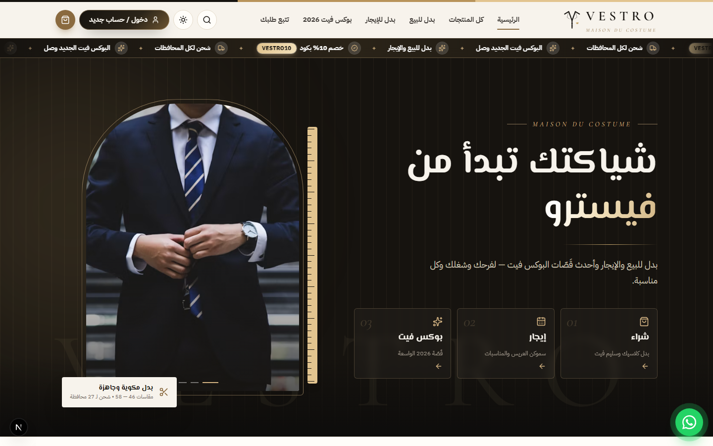
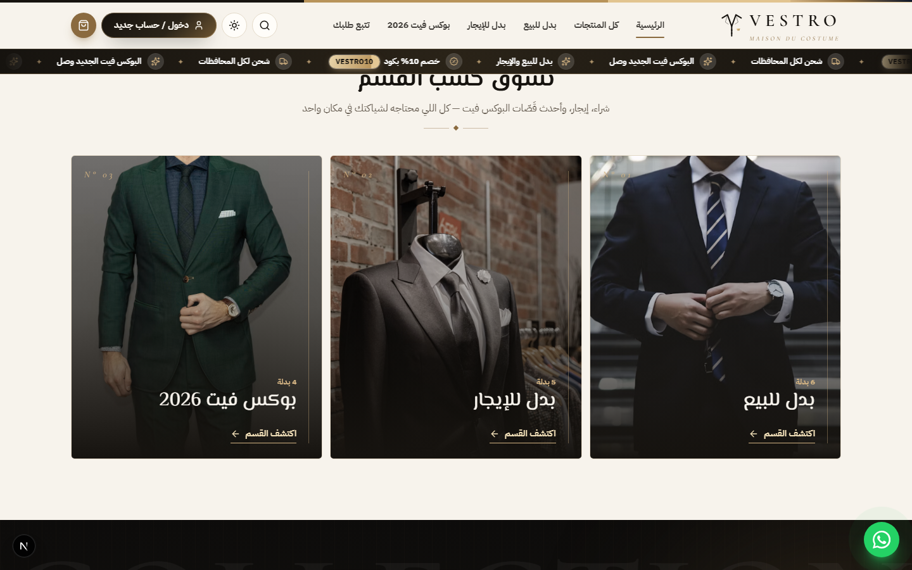
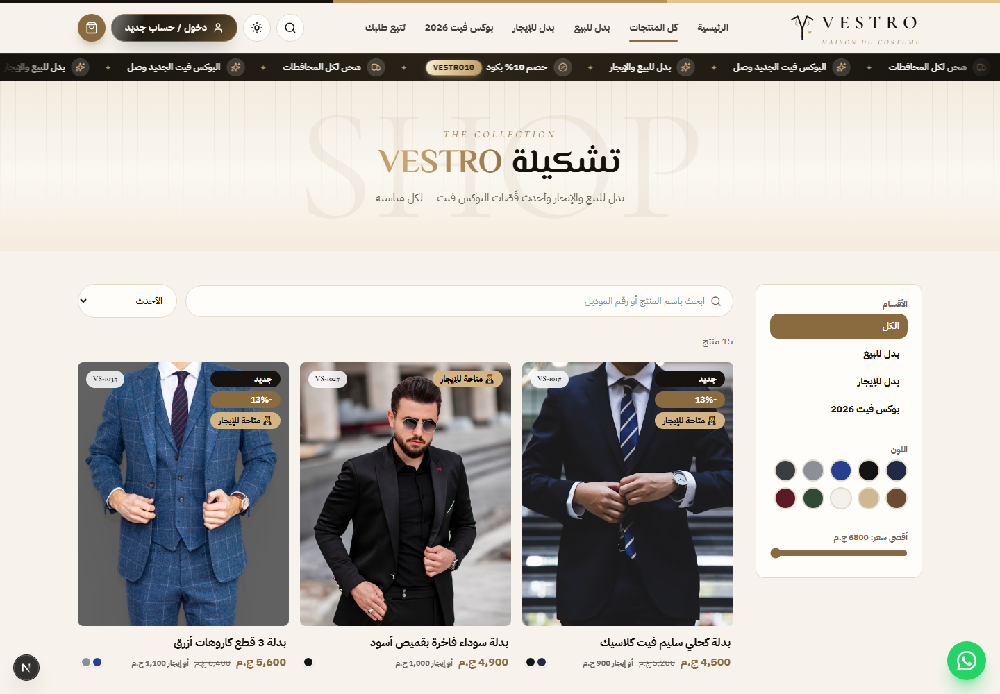
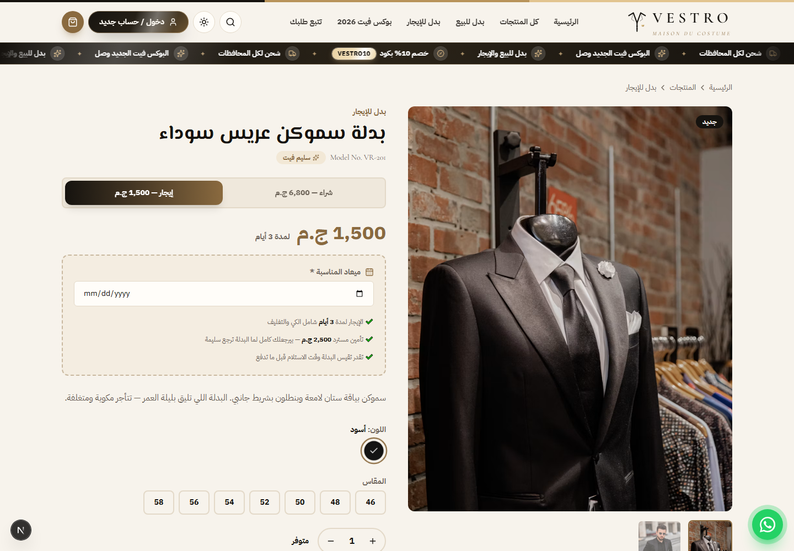
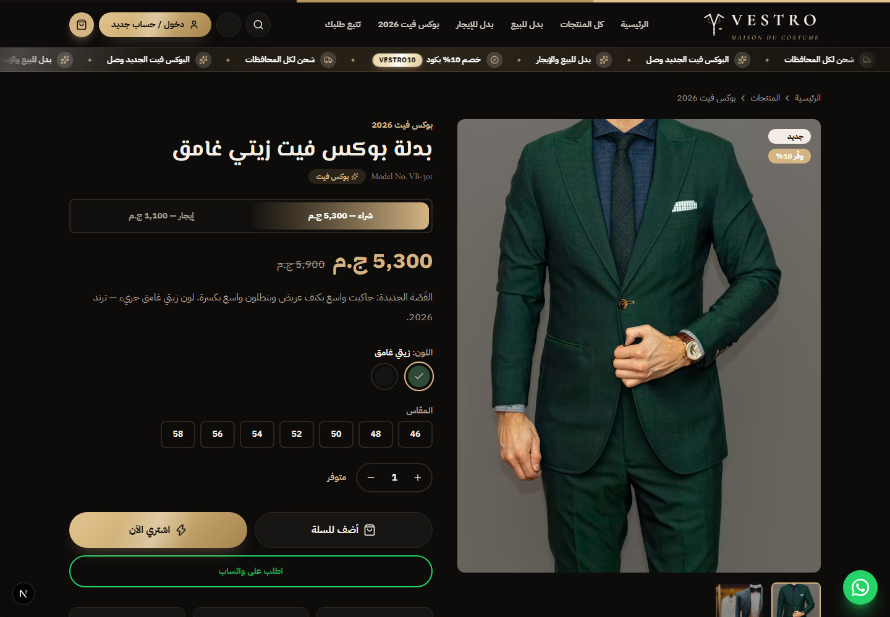
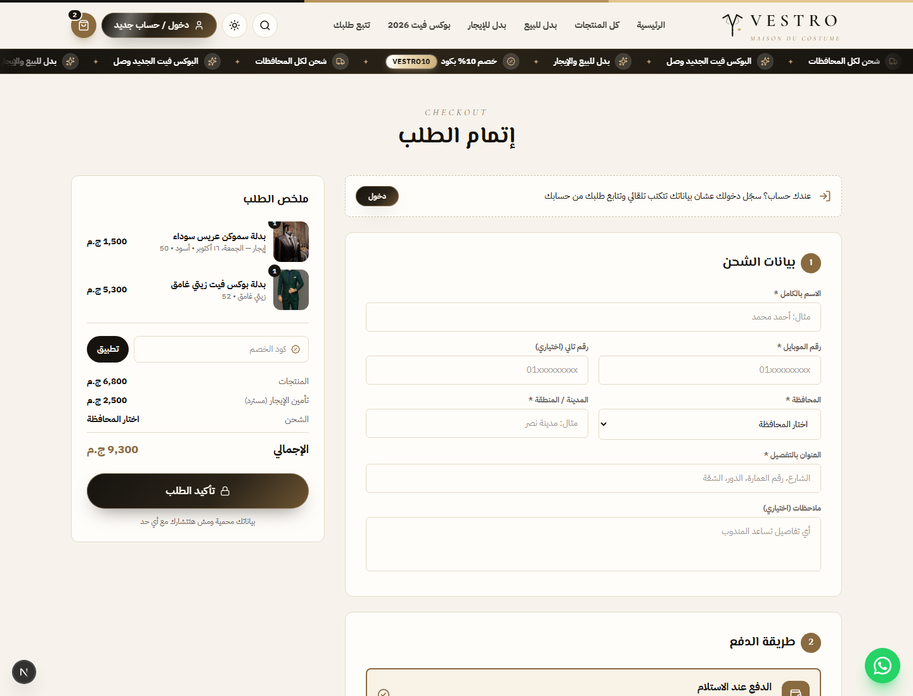
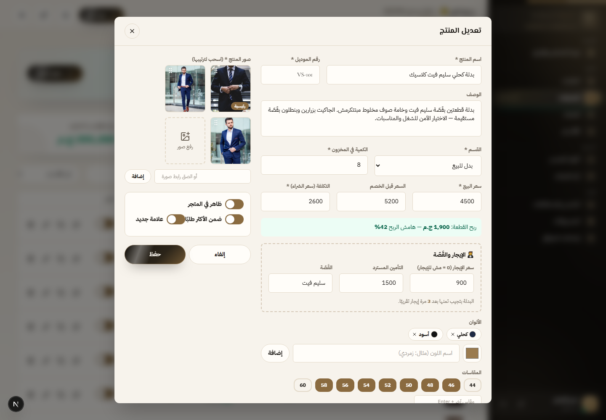

<p align="center">
  
</p>

<p align="center">
  
  
  
  
  
</p>

<p align="center">
  
</p>

<div dir="rtl">

## 🤵 عن المشروع

**VESTRO — فيسترو** متجر أونلاين لبدل رجالي: **بيع • إيجار • بوكس فيت** — بهوية "أتيليه خياطة" فاخرة: أسود فحمي وعاجي وذهبي شامبين، خطوط El Messiri و Cormorant، قماش مقلّم (pinstripe) في الخلفيات، ومراية بروفة في الهيرو بشريط مقاس. عربي RTL، لايت / دارك، ولوحة تحكم كاملة بالأرباح — ومعاه نظام **إيجار البدل** للعرسان والمناسبات.

| | |
|---|---|
| 🪞 **هيرو "مراية البروفة"** | صور البدل جوه برواز ذهبي بقوس + شريط مقاس متحرك + 3 مداخل: شراء • إيجار • بوكس فيت |
| 🪡 **أقسام على الشماعة** | البانل اللي تقف عليه بيتفرد ويحكي القسم بأنيميشن |
| 🛍️ **شراء أو إيجار** | في صفحة البدلة تختار شراء أو إيجار بضغطة، والسعر بيتغيّر بأنيميشن |
| 📅 **ميعاد المناسبة** | في الإيجار العميل بيختار يوم المناسبة (من بكرة لحد 6 شهور) |
| 🔐 **تأمين مسترد** | كل بدلة إيجار ليها تأمين بيتضاف للإجمالي وبيرجع للعميل لما البدلة ترجع |
| ✨ **بوكس فيت 2026** | قسم للقَصّة الجديدة الواسعة + علامة BOX FIT على الكروت |
| 🎠 **كوليكشن 3D** | حلقة بدل بتلف زي الشماعة — بالماوس أو بالصباع |
| 🚚 **شحن ودفع** | 27 محافظة • الدفع عند الاستلام • "افحص وقيس قبل ما تدفع" |
| 🧑‍💼 **لوحة التحكم** | سعر البيع + سعر الإيجار + التأمين + القَصّة لكل بدلة، والطلبات بتوضّح الإيجار وميعاده |

## 📸 لقطات

| 🪡 الأقسام — بدل على الشماعة بتتفرد مع الماوس | 🛍️ المتجر |
|---|---|
|  |  |
| **🤵 الإيجار — ميعاد المناسبة والتأمين** | **🌙 البوكس فيت — الوضع الليلي** |
|  |  |
| **🧾 الدفع — الإيجار والتأمين المسترد** | **🧑‍💼 لوحة التحكم — سعر الإيجار والتأمين والقَصّة** |
|  |  |

## ⚙️ إزاي الإيجار شغال

- البدلة تبقى **متاحة للإيجار** لو ليها `سعر إيجار` في لوحة التحكم (0 = بيع بس).
- الإيجار **مش بيخصم من المخزون** (البدلة بترجع)، والشراء بيخصم.
- مدة الإيجار (افتراضي 3 أيام) من `settings.rentDays`.
- السيرفر بيتحقق من السعر والتأمين والميعاد بنفسه — العميل مايقدرش يغيّرهم.

## 🚀 التشغيل

```bash
npm install
npm run dev          # http://localhost:3000
npm run build && npm start
```

- لوحة التحكم: `/admin` — اعمل `.env.local` فيه `ADMIN_EMAIL` و `ADMIN_PASSWORD` و `ADMIN_SECRET` (**لازم تتغير قبل النشر**).
- البيانات في `data/db.json` وبتتعمل تلقائي أول تشغيل. على Vercel بتتحفظ في `/tmp` (ديمو — بتتمسح كل فترة)؛ للمتجر الحقيقي استخدم سيرفر Node بديسك ثابت.
- الصور الحالية صور مؤقتة مجانية من Unsplash — بدّلها بصور البدل الحقيقية من لوحة التحكم.

## 📞 التواصل

**المهندس إبراهيم سمير** — واتساب [01055673184](https://wa.me/201055673184) • [01055673184hs@gmail.com](mailto:01055673184hs@gmail.com)

</div>
